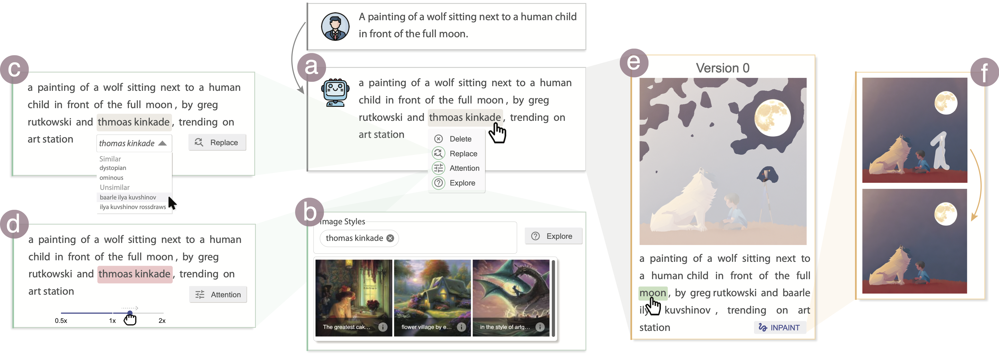

# PromptCharm: Text-to-Image Generation through Multi-modal Prompting and Refinement



PromptCharm is an interactive system for iterative refinement of text-to-image creation with diffusion models.
This repository contains the official implementation of our related paper:

**PromptCharm: Text-to-Image Generation through Multi-modal Prompting and Refinement**

*Zhijie Wang, Yuheng Huang, Da Song, Lei Ma, Tianyi Zhang*

2024 ACM CHI Conference on Human Factors in Computing Systems (CHI 2024)

## Getting Started

### Environments Set-up

#### Python >= 3.6

*We suggest use virtual environment to avoid messing up your own environments.*

Please follow `backend/README.md` for details.

#### NPM >= 7

~~~sh
$ cd ./web/dashboard
$ npm install
~~~

### Basic Usage

#### Quick start

~~~sh
$ npm start
~~~
Copy the url and open it in browser.

#### Start backend

~~~sh
$ cd ./backend
$ python main.py
~~~


## Citation

If you found our paper/code useful in your research, please consider citing:

```
@inproceedings{wang2024promptcharm,
 author = {Wang, Zhijie and Huang, Yuheng and Song, Da and Ma, Lei and Zhang, Tianyi},
 title = {PromptCharm: Text-to-Image Generation through Multi-modal Prompting and Refinement},
 booktitle = {Proceedings of the 2024 CHI Conference on Human Factors in Computing Systems},
 year = {2024},
} 
```

## License

This project is released under the [MIT license](./LICENSE.md).

## Acknowledgement

Kudos to the following projects:

- [DAAM](https://github.com/castorini/daam)
- [ecco](https://github.com/jalammar/ecco)
- [DeepSeer](https://github.com/Momentum-Research/DeepSeer)
- [DeepLens](https://github.com/Momentum-Research/DeepLens)